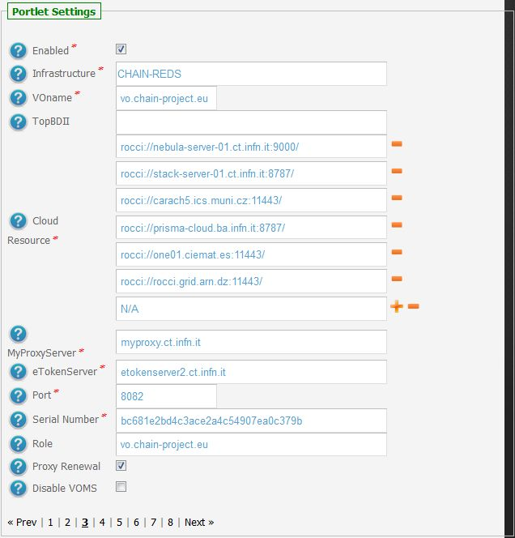
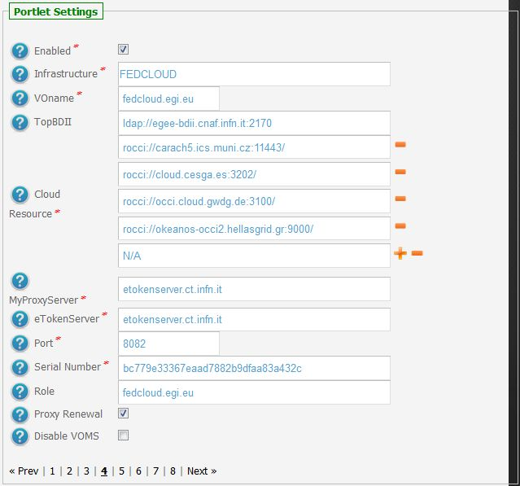
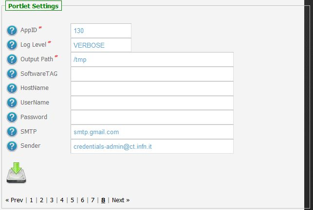
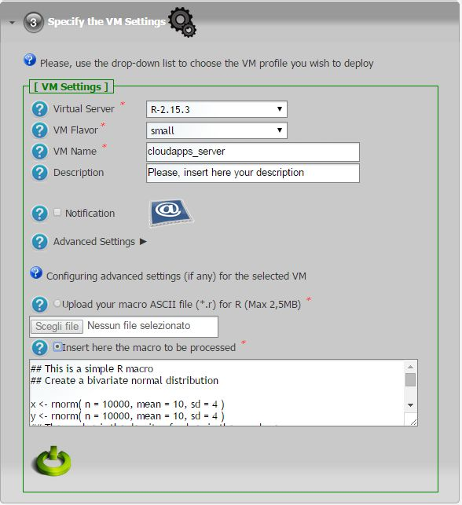

*********************
CLOUDAPPS v1.1.0 Docs
*********************

============
About
============

With this service it is possible to execute scientific applications on Virtual Machines (VMs) deployed on standard-based federated cloud.

The present service is based on the following standards and software frameworks: 

|JSAGA| |OCCI|

============
Installation
============
To install this portlet the WAR file has to be deployed into the application server.

As soon as the portlet has been successfully deployed on the Science Gateway the administrator has to configure:

- the list of e-Infrastructures where the application can be executed;

- some additional application settings.

1.) To configure a generic e-Infrastructure, the following settings have to be provided:

**Enabled**: A true/false flag which enables or disable the generic e-Infrastructure;

**Infrastructure**: The acronym to reference the e-Infrastructure;

**VOName**: The VO for this e-Infrastructure;

**TopBDII**: The Top BDII for this e-Infrastructure;

**WMS Endpoint**: A list of WMS endpoint for this e-Infrastructure (max. 10);

**MyProxyServer**: The MyProxyServer for this e-Infrastructure;

**eTokenServer**: The eTokenServer for this e-Infrastructure;

**Port**: The eTokenServer port for this e-Infrastructure;

**Serial Number**: The MD5SUM of the robot certificate to be used for this e-Infrastructure;

.. _CHAIN_REDS: http://www.chain-project.eu/
.. _1: http://science-gateway.chain-project.eu
.. _2: https://www.egi.eu/infrastructure/cloud/

In the following figure is shown how the portlet has been configured to run simulation on the CHAIN_REDS Cloud Testbed from the project Science Gateway [1_].

In the following figure is shown how the portlet has been configured to run simulation on the EGI Federated Cloud Infrastructure [2_] from the project Science Gateway [1_].

2.) To configure the application, the following settings have to be provided:

**AppID**: The ApplicationID as registered in the UserTracking MySQL database (GridOperations table);

**Software TAG**: The list of software tags requested by the application;

**SMTP Host**: The SMTP server used to send notification to users;

**Sender**: The FROM e-mail address to send notification messages about the jobs execution to users;

In the figure below is shown how the application settings have been configured to run on the CHAIN_REDS_ Science Gateway [1_].

============
Usage
============

To run the simulations the user has to:

- click on the *third* accordion of the portlet,

- select the VM to run on the available Cloud Testbed as shown in the below figure:

Each simulation will produce:

- *std.out*: the standard output file;

- *std.err*: the standard error file;

- *.tar.gz*: the output results.

.. _Rplot: results/Rplots.pdf

A typical simulation produces, at the end, the following files:

.. code:: bash

        ]$ tree Pleaseinserthereyourdescription_148684/
        Pleaseinserthereyourdescription_148684/
        ├── results.tar.gz
        ├── std.err
        └── std.out

The list of files produced during the run are the following:

.. code:: bash

        ]$ tar ztvf results.tar.gz
        output.README
        Rplots.pdf

For further detail, please download the PDF file Rplots_

============
Support
============
Please feel free to contact us any time if you have any questions or comments.

.. _INFN: http://www.ct.infn.it/

:Authors:
 
 `Roberto BARBERA <mailto:roberto.barbera@ct.infn.it>`_ - Italian National Institute of Nuclear Physics (INFN_),

 `Giuseppe LA ROCCA <mailto:giuseppe.larocca@ct.infn.it>`_ - Italian National Institute of Nuclear Physics (INFN_),
 
:Version: v1.1.0, 2015

:Date: June 1st, 2015 17:06
